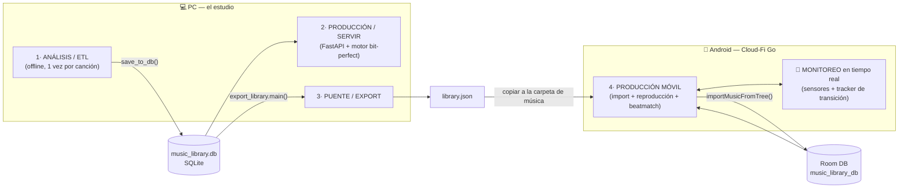
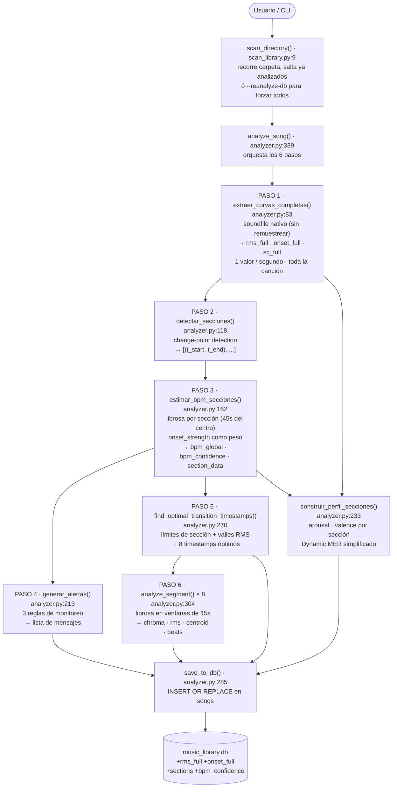
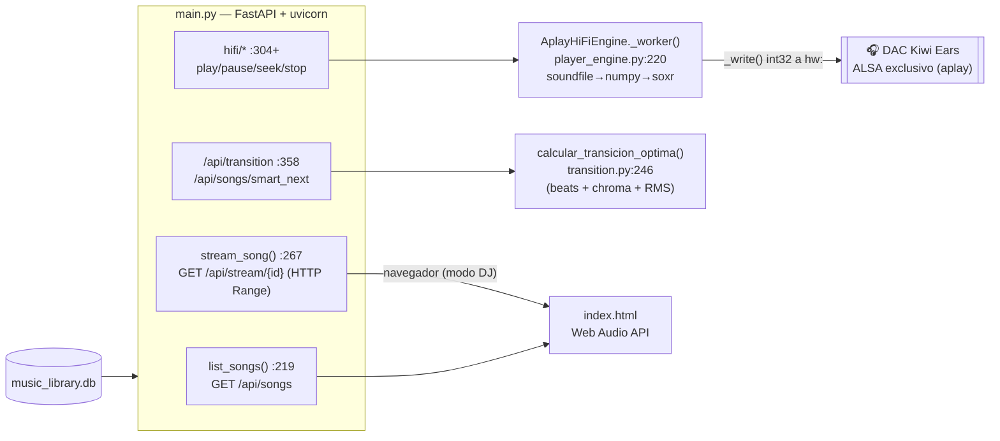
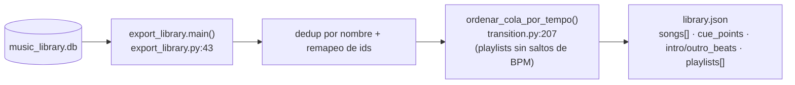
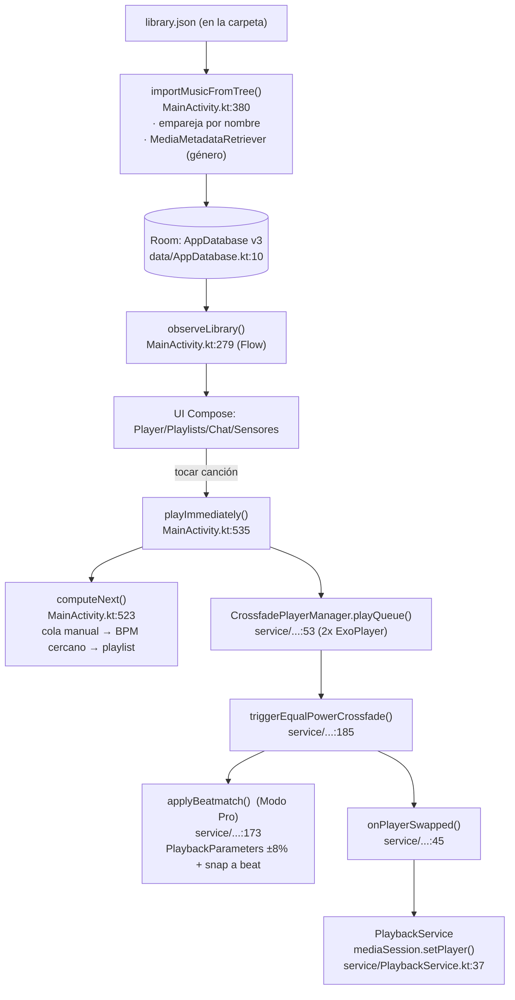
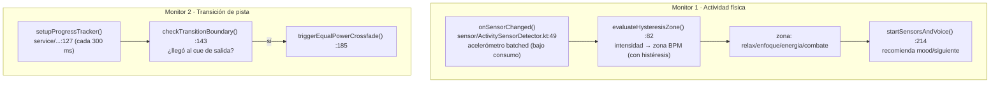

# Guía de Desarrollador — Cloud-Fi

Dos apps que comparten una biblioteca precomputada:

| App | Rol | Tecnología |
|---|---|---|
| **PC — "el estudio"** | Análisis, Hi-Fi bit-perfect, DJ, **export** | Python / FastAPI |
| **Android — "Cloud-Fi Go"** | Reproductor autónomo offline, activity-aware | Kotlin / Jetpack Compose |

**Puente:** `python export_library.py` → `export/library.json` → se copia a la carpeta de música del celular.
El celular **no analiza nada** (batería mínima); consume metadatos precomputados.

---

## 1. Pipeline (PC)

```
[1 ESCANEO]            [2 SERVIR]              [3 REPRODUCIR]
scan_library.py        main.py (FastAPI)       player_engine.py (AplayHiFiEngine)
   |                      |                       |
   v                      v                       v
analyzer.analyze_song  GET /api/songs ----> index.html
 - feature.tempo (BPM) GET /api/stream/{id}   | Hi-Fi: POST /api/hifi/* -> aplay -> DAC (bit-perfect)
 - chroma/beats/rms    POST /api/hifi/*       | DJ:    stream + Web Audio (navegador)
 - cue_points          POST /api/transition   v
   |                   POST /api/search      transición inteligente (transition.py)
   v                   /api/playlists
music_library.db
   |
   v
[4 EXPORTAR] export_library.py -> export/library.json -> [5 APP ANDROID]
```

### Frameworks
| Herramienta | Rol |
|---|---|
| **FastAPI + uvicorn** | Servidor/API: sirve `index.html`, REST y streaming. |
| **SQLite** (`music_library.db`) | 1 fila/canción (bpm, duración, vectores intro/outro, `transition_points`) + tabla `playlists`. |
| **librosa** | Análisis offline (BPM, chroma, beats, RMS). Pesado; solo en escaneo. |
| **soundfile / numpy / soxr** | Decodifica FLAC, mezcla equal-power, resample con estado (cross-rate sin clics). |
| **aplay** (alsa-utils) | Salida `hw:` directo = ALSA exclusivo **bit-perfect**. |
| **Web Audio API** | Modo DJ: reproduce/mezcla en el navegador (no bit-perfect). |

> El chat y `smart_next` usan **palabras clave + BPM/chroma del audio real** (ya **no** hay `sentence-transformers`/`torch`; eliminados por desproporcionados). El motor `mpv` viejo también fue retirado.

## 2. Módulos Python
- `analyzer.py` — **v2**: segmentación estructural + BPM por sección ponderado por onset + Dynamic MER simplificado + alertas de consistencia. Ver **Sección 9** para documentación completa.
- `scan_library.py` — recorre la carpeta, salta lo ya analizado (o fuerza re-análisis con `--reanalyze-all` / `--reanalyze-db`), llama a `analyzer` y guarda en SQLite.
- `main.py` (FastAPI) — endpoints `songs`, `stream`, `hifi/*`, `transition`, `smart_next`, `search`, `playlists`.
- `player_engine.py` — `AplayHiFiEngine`: worker bit-perfect (soundfile→numpy→soxr→aplay), crossfade equal-power, coordina PipeWire para tomar el DAC en exclusivo.
- `transition.py` — decisión de transición: BPM octava-aware, compatibilidad tonal (chroma), alineación de beats, cruce óptimo por RMS, y **`ordenar_cola_por_tempo()`** (encadena BPMs cercanos para evitar saltos fuerte→alegre).
- `export_library.py` — vuelca la DB a `export/library.json` (deduplica por nombre, remapea y **ordena playlists por tempo**).
- `voice_assistant.py` — asistente de voz local.

## 3. Motor de transición (`transition.py`)
`calcular_transicion_optima(outro_A, intro_B, bpm_A, bpm_B)` → árbol de decisión:
- **crossfade_suave** — BPM alineables (Δ<8%, octava-aware) + armonía compatible (cos>0.75). Cruce largo y fluido (duración óptima por RMS).
- **barrido_filtro** — BPM alineables pero choque armónico. Filtro pasa-bajos progresivo.
- **eco_delay** — choque de BPM pero armonía aceptable. Eco rítmico como puente.
- **freno_vinilo** — choque total. Desaceleración rápida + corte seco.

> El algoritmo es correcto; la causa de "transiciones inconsistentes" es la **secuencia** (pares 150→95). Por eso el export y la cola del app **ordenan por tempo**.

## 4. Formato `library.json` (lo que consume el app)
```json
{
  "version": 1, "count": 138,
  "moods": ["accion","energia","enfoque","relax"],
  "songs": [{
    "id": 3, "file": "Artista - Titulo.flac",
    "title": "...", "artist": "...", "bpm": 123.0, "duration": 222.6, "mood": "energia",
    "cue_points": [{"t":0.0,"energia":0.31,"clase":"nivel_4","tipo":"intro"}, ...]
  }],
  "playlists": [{"name":"Combate","song_ids":[3,147],"target_bpm":140}]
}
```
- `mood` por BPM: relax(<95) · enfoque(95-115) · energia(115-125) · accion(≥125).
- cue point "enérgico" = `nivel ≥ 6`. `file` = nombre de archivo exacto (clave del emparejamiento en el app).

## 5. App Android "Cloud-Fi Go"
**Ubicación del proyecto Gradle:** `/media/usuario/CIENCIA DE DATOS` (NO dentro de esta carpeta).
`com.cloudfi.go` · Kotlin + Compose · Media3/ExoPlayer · **Room 2.8.4 vía KSP** (kapt no compila con AGP 9.2 + Kotlin 2.2.10).

**Build/install desde CLI** (no hay JAVA_HOME global; usar el JBR de Android Studio):
```bash
cd "/media/usuario/CIENCIA DE DATOS"
export JAVA_HOME="$(pwd)/android-studio/jbr"; export PATH="$JAVA_HOME/bin:$PATH"
./gradlew :app:assembleDebug
./platform-tools/adb install -r app/build/outputs/apk/debug/app-debug.apk
```
> **Gotcha:** con `configuration-cache=true`, al añadir assets nuevos `mergeDebugAssets` puede quedar UP-TO-DATE y no empaquetarlos. Forzar `:app:clean ... --no-configuration-cache` y verificar `unzip -l <apk> | grep assets`.

**Lógica que reimplementa el app (mate simple, sin DSP):**
- Importa la carpeta (SAF), empareja cada FLAC con el `library.json` (de la carpeta o el incluido) por nombre.
- Crossfade equal-power con 2 ExoPlayer (limitado a 0 dBFS), guard anti-reentrada, mezcla simétrica A↔B continua.
- **Siguiente por BPM más cercano** (octava-aware) al reproducir una canción suelta; playlists en su orden.
- Modo actividad por acelerómetro + voz offline (`SpeechRecognizer`).

**Pendiente — "Modo Pro" (beatmatch real):** exportar `intro_beats`/`outro_beats` (+rms) en `library.json`, portar `_alinear_beats`/cruce óptimo a Kotlin, y que el motor alinee la entrada al beat (+ `PlaybackParameters` ±8%).

## 6. Cómo correr / probar
```bash
uv run main.py                         # servidor PC
uv run scan_library.py "<carpeta>"     # escanear por terminal
python export_library.py               # exportar para el app
```
Tests: `test_basics.py` (requiere `pytest`).

## 7. Deuda técnica (no urgente)
- `main.py` (~640 líneas) mezcla streaming/NLP/playback/playlists/voz → partir en routers.
- `@app.on_event` deprecado → migrar a `lifespan`.

---

## 8. Diagramas de arquitectura (pipelines, código y frameworks)

> **Cómo verlos:** estos diagramas son **Mermaid** — GitHub y VS Code (extensión *Markdown Preview Mermaid*) los renderizan solos. Para **draw.io**: `Arrange → Insert → Advanced → Mermaid…` y pega el bloque; quedará editable como organigrama.
>
> **Aclaración honesta sobre "entrenamiento":** este proyecto **no entrena ningún modelo de ML**. Lo que parece "entrenamiento" es la **etapa de Análisis/ETL**: extracción **determinista** de características con DSP (librosa). No hay pesos, ni dataset de entrenamiento, ni inferencia de red neuronal (los modelos `sentence-transformers`/`torch` se eliminaron por desproporcionados). Por eso abajo se llama **Análisis**, no "Entrenamiento".

### 8.1 Visión global (las 4 etapas + monitoreo)



### 8.2 Pipeline 1 — Análisis / ETL v2 (precómputo determinista, 6 pasos)


**Frameworks:** `soundfile` (Paso 1, carga sin remuestrear), `librosa` (Pasos 3 y 6, DSP pesado), `numpy` (todos los cálculos vectoriales). Ver **Sección 9** para el detalle función por función.

### 8.3 Pipeline 2 — Producción / Serving (PC, bit-perfect)


**Frameworks:** `FastAPI` (API/streaming), `soundfile`+`numpy`+`soxr`+`aplay` (ruta **bit-perfect**), `Web Audio` (modo DJ en navegador).

### 8.4 Pipeline 3 — Puente / Export



### 8.5 Pipeline 4 — Producción móvil (Android) + Beatmatch (Modo Pro)


**Frameworks:** `Media3/ExoPlayer` (reproducción FLAC + crossfade), `Room` (biblioteca offline), `Jetpack Compose` (UI), `MediaSession` (controles de sistema/lock-screen).

### 8.6 Etapa de MONITOREO (tiempo real) — la "segunda etapa"

Hay **dos lazos de monitoreo** que corren mientras suena la música:


- **Monitor 1** = *activity-aware*: el acelerómetro estima tu intensidad y ajusta la música. Es lo más cercano a "telemetría/monitoreo" del sistema.
- **Monitor 2** = el *tracker* de reproducción que vigila la posición cada 300 ms para disparar la transición en el punto correcto.

### 8.7 Leyenda — por qué cada framework (y por qué NO otros)

| Framework | Rol · dónde | Por qué este | Por qué no la alternativa |
|---|---|---|---|
| **FastAPI** | API/streaming · `main.py` | Async, tipado (Pydantic), streaming con `StreamingResponse` y Range nativo | **Flask**: sync, sin tipado/async de fábrica. **Django**: pesado (ORM/admin) innecesario para 1 usuario local |
| **librosa** | Análisis DSP · `analyzer.py` | Estándar de facto en MIR; `onset.onset_strength`, `feature.tempo`, chroma, beats. El v2 lo usa **solo por sección** (no sobre la canción completa) para precisión y velocidad. | **Essentia**: implementa BIC-segmentation y BeatTrackerMultiFeature (multi-feature, con confidence score nativo) pero requiere C/C++ con build frágil. **madmom**: redes neuronales para beat tracking, excelente en 3/4 y folk, pero dependencia pesada. Ninguno vale el costo de build para un ETL offline. |
| **soundfile + numpy + soxr + aplay** | Motor **bit-perfect** · `player_engine.py` | Control total del flujo de muestras → `hw:` directo = ALSA exclusivo a frecuencia nativa | **mpv/MPD**: no garantizan bit-perfect ni control de rate (se retiró el motor mpv). **pyaudio**: añade resample oculto |
| **SQLite** | DB local · `music_library.db` | Cero-servidor, 1 archivo, perfecto para 1 usuario offline | **Postgres/MySQL**: requieren servidor; sobran para local-first |
| **Media3 / ExoPlayer** | Reproductor Android · `CrossfadePlayerManager` | 2 instancias para crossfade real, FLAC nativo, `PlaybackParameters` (beatmatch sin cambiar tono), `MediaSession` | **MediaPlayer** (AOSP): 1 stream, sin crossfade ni control fino; **deprecado** para casos serios |
| **Room** | Persistencia Android · `AppDatabase` | Capa tipada sobre SQLite con `Flow` reactivo para Compose | **SQLite crudo**: boilerplate y sin reactividad; **Realm**: dependencia grande y menos estándar |
| **Jetpack Compose** | UI Android | Declarativo, estado reactivo, animaciones (mini↔maximizado) simples | **XML Views**: verboso, sin estado reactivo; el equipo de Android lo da por camino principal |

> Si en el futuro se quiere **IA real** en el chat (no reglas), la fuente recomendada es la **API de Claude** (texto→intención) en el PC, **no** reintroducir `torch` local (~2-3 GB). Cualquier cambio de framework debería re-evaluarse contra estos criterios antes de adoptarse.

---

## 9. Motor de Análisis v2 — Documentación técnica completa (`analyzer.py`)

Esta sección documenta cada función del nuevo analizador: qué calcula, cómo lo calcula, qué frameworks usa y por qué, qué variables toma y qué produce.

### 9.1 Por qué cambió el motor (problema de la v1)

La v1 estimaba el BPM tomando **30 segundos del centro de la canción** y aplicando `librosa.feature.tempo` directamente. Esto fallaba sistemáticamente en:

| Caso | Ejemplo | Causa del fallo |
|------|---------|----------------|
| Canción con sección energética al final | *The Chain* (Fleetwood Mac) | Los 30s del centro caen en la zona tranquila; el BPM del riff final (152 BPM) nunca se capturaba |
| Canción lenta / ambient | *Alps* (Motorama), *De la Nada* (W. Luna) | El beat es débil; `feature.tempo` detecta patrones melódicos en vez del ritmo y estima el doble del tempo real |
| Huayno / 3/4 / folk andino | *De la Nada* (W. Luna) | `librosa` optimizado para 4/4 occidental; en 3/4 elige el acento equivocado como pulso |

La v2 resuelve esto con **segmentación estructural** + **BPM por sección ponderado** + **auto-corrección de octava basada en onset**.

---

### 9.2 Principio conceptual: Dynamic MER + Audio Segmentation

El diseño sigue dos conceptos de Music Information Retrieval (MIR):

**Audio Segmentation** (Essentia usa SBic — Segmentation by Bayesian Information Criterion):
> Detectar en qué momentos la distribución estadística de las features cambia significativamente. Esos cambios = límites de sección.

El proyecto no implementa BIC (requiere scipy.stats y es más lento), sino **change-point detection por distancia euclidea + peak_pick**, que es equivalente en resultado para este uso.

**Dynamic Music Emotion Recognition (MER)** (basado en el Circumplex de Russell):
> Cada punto del tiempo tiene dos dimensiones: arousal (energía) y valence (positividad tímbrica). Rastreadas por sección, dan el "perfil emocional" de la canción.

El proyecto no usa ML (no hay modelo entrenado) sino **proxies acústicos directos**:
- `arousal ≈ onset_strength_mean` normalizado (señal rítmica = energía percibida)
- `valence ≈ spectral_centroid_mean` normalizado (timbre brillante/agudo = "positivo" en percepción auditiva)

---

### 9.3 Paso 1 — `extraer_curvas_completas()` (líneas 83–115)

**Propósito:** obtener tres curvas de 1 valor/segundo de toda la canción en una sola pasada, sin cargar el audio dos veces.

**Framework:** `soundfile` (carga), `numpy` (FFT y aritmética vectorial).

**Por qué soundfile aquí y no librosa:** `sf.read()` devuelve el audio a la frecuencia de muestreo nativa (44.1 kHz o 48 kHz) sin aplicar ningún resample. `librosa.load()` normalizaría y remuestraría a 22050 Hz, lo que sería costoso para una canción completa (~10–30 MB de RAM extra y 2–5 s de procesado). Con `sf.read` la carga es casi I/O puro.

**Variables de entrada:**
- `filepath` — ruta al archivo FLAC/MP3/WAV

**Cálculo interno:**
```
block = int(sr_native)          # muestras en 1 segundo (44100 ó 48000)
freqs = rfftfreq(block, 1/sr)   # vector de frecuencias para el centroide

Para cada bloque i de 1 segundo:
  seg = y[i*block : (i+1)*block]

  RMS_i       = √( mean(seg²) )
               → energía del bloque (proxy de volumen percibido)

  mag_i       = |FFT(seg)|      # espectro de magnitudes (22050 ó 24000 bins)
  SC_i        = Σ(freq_k · mag_k) / Σ(mag_k)
               → centroide espectral (Hz del "centro de masa" del espectro)
               → más alto = timbre más brillante/agudo

  flux_i      = Σ( max(0,  mag_i - mag_{i-1}) )
               → spectral flux HWR (half-wave rectified)
               → suma de los incrementos espectrales positivos
               → proxy de onset: sube en ataques, baja en decaídas
```

**Variables de salida:**
- `rms_full` — `list[float]`, longitud = duración en segundos. Guardado en BD como `rms_full` (JSON).
- `onset_full` — `list[float]`, mismo largo. Spectral flux crudo (valores ~10⁴–10⁶, escala del SR nativo). Guardado en BD como `onset_full`.
- `sc_full` — `list[float]`, spectral centroid en Hz. Usado solo en memoria para la segmentación y el perfil MER; no se guarda por separado (se resume en `sections`).
- `sr_native` — `int`, frecuencia de muestreo detectada.

> **Nota sobre escala de `onset_full`:** los valores son grandes (∼10⁴–10⁶) porque son sumas de magnitudes FFT a resolución nativa. Se normalizan internamente (z-score) antes de usarse; no tienen que estar en ninguna escala específica.

---

### 9.4 Paso 2 — `detectar_secciones()` (líneas 118–159)

**Propósito:** encontrar los puntos donde la música cambia de carácter (intro→estrofa, estrofa→coro, coro→puente, etc.) sin análisis de letra ni etiquetas.

**Framework:** `numpy` (z-score, suavizado), `librosa.util.peak_pick` (detección de picos).

**Por qué peak_pick de librosa:** implementa búsqueda de picos con ventana de `pre_max/post_max` (el punto es mayor que sus vecinos) **y** media local `pre_avg/post_avg` (el punto supera la media del entorno por un delta mínimo). Esto elimina picos espurios sin necesidad de scipy.signal.

**Variables de entrada:**
- `rms_full`, `onset_full`, `sc_full` — las tres curvas del Paso 1
- `min_dur` — segundos mínimos entre límites de sección (default: 25)

**Algoritmo:**

```
1. Normalización z-score de cada curva:
   x_z = (x - mean(x)) / std(x)
   → Las tres features quedan en la misma escala, sin que
     una domine a las demás por tener valores más grandes.

2. Distancia euclidea entre frames consecutivos:
   δ_i = √( (rms_z[i+1] - rms_z[i])²
           + (onset_z[i+1] - onset_z[i])²
           + (sc_z[i+1] - sc_z[i])² )
   → δ_i es alto donde la música cambia de carácter.
   → Es un vector de longitud (n-1) segundos.

3. Suavizado gaussiano (ventana 21 muestras, σ=5 seg):
   win_k = exp(-0.5 · (k - 10)² / 25)  para k=0..20
   δ_suave = convolve(δ, win, 'same')
   → Elimina cambios micro (< 10s) que no son secciones reales.

4. Umbral de detección:
   threshold = mean(δ_suave) + 0.5 · std(δ_suave)
   → Solo picos que superen este umbral se consideran límites.

5. Detección de picos:
   librosa.util.peak_pick(δ_suave,
       pre_max  = min_dur // 2,   # ventana local de máximo
       post_max = min_dur // 2,
       pre_avg  = min_dur,        # ventana de media local
       post_avg = min_dur,
       delta    = threshold - mean(δ_suave),
       wait     = min_dur         # distancia mínima entre picos = 25s
   )
   → Devuelve índices i donde δ_suave tiene picos prominentes.

6. Construcción de secciones:
   boundaries = {0} ∪ {pico + 1} ∪ {n}  (ordenados)
   → Una sección corta (< min_dur) se fusiona con la anterior.
```

**Variables de salida:**
- Lista de `(t_start, t_end)` en segundos (enteros, porque el array es de 1 val/seg).
- Ejemplo típico para una canción de 4 min: `[(0,62), (62,142), (142,213), (213,275), (275,311)]`

**Conexión con la teoría:** la distancia euclidea en el espacio [RMS, onset, SC] es equivalente a la "divergencia de distribución" que usa el BIC de Essentia — ambos detectan dónde el vector de features cambia estadísticamente. El BIC es más formal (penaliza complejidad del modelo) pero requiere scipy.stats y es más lento; la distancia euclidea es suficiente para 3 features normalizadas.

---

### 9.5 Paso 3 — `estimar_bpm_secciones()` (líneas 162–210)

**Propósito:** estimar el BPM con mayor precisión, aprovechando que cada sección tiene un carácter diferente, y producir un BPM global ponderado por la calidad rítmica de cada sección.

**Framework:** `librosa` (`onset.onset_strength`, `feature.tempo`, `beat.beat_track`), `numpy`.

**Por qué `onset_strength` explícita:** `librosa.feature.tempo(y=y, sr=sr)` calcula internamente el onset_strength, pero no lo expone. Al calcularlo primero con `librosa.onset.onset_strength(y, sr)`, obtenemos la media como indicador de calidad antes de pasarlo a `feature.tempo`. Esto es equivalente al *confidence score* de Essentia's `BeatTrackerMultiFeature`.

**Variables de entrada:**
- `filepath` — ruta al archivo
- `secciones_seg` — lista de `(t_start, t_end)` del Paso 2

**Cálculo por sección:**

```
Para cada sección (t_start, t_end):

  Si (t_end - t_start) < 25s → sección muy corta, saltar
                                (no hay suficiente audio para BPM fiable)

  sample_dur    = min(45s, duración)
  sample_offset = t_start + (duración - sample_dur) / 2
  → Toma 45s del CENTRO de la sección.
    Si la sección tiene 200s, analiza los 45s del centro.
    Evita los bordes donde la sección puede estar en transición.

  y, sr = librosa.load(filepath, sr=22050,
                        offset=sample_offset, duration=sample_dur)
  → Carga solo ese fragmento a 22050 Hz (SR estándar de análisis MIR).

  onset_env  = librosa.onset.onset_strength(y=y, sr=sr)
  → Espectral flux normalizado por librosa (HWR del cambio espectral).
  → Valores típicos: ~1–5 para canciones suaves, ~10–50 para energéticas.
  onset_mean = mean(onset_env)
  → Indicador de calidad del beat en este fragmento.
    Alto = beat claro y perceptible.
    Bajo = canción ambient/lenta, el estimador de BPM será menos confiable.

  t = librosa.feature.tempo(onset_envelope=onset_env, sr=sr)
  bpm_local = _fold_octava( t[0] )
  → feature.tempo calcula el tempograma por autocorrelación del onset_env
    y devuelve el periodo dominante.
  → _fold_octava() corrige errores de ½x o 2x al rango [70, 160]:
    mientras bpm > 160: bpm /= 2
    mientras bpm < 70:  bpm *= 2
```

**BPM global ponderado:**

```
bpm_global = Σ(bpm_i · onset_i) / Σ(onset_i)
           = promedio ponderado donde el peso es onset_mean_i
→ Las secciones con beat claro (onset alto) dominan el promedio.
→ Las secciones suaves o sin beat claro apenas aportan.

→ _fold_octava(bpm_global) para corrección final.
```

**Auto-corrección de octava para canciones suaves:**

```
cv = std(bpms) / mean(bpms)   # coeficiente de variación

Si bpm_global > 100
   AND max(onset_means) < 5.0  # toda la canción tiene onset débil
   AND cv < 0.20               # las secciones concuerdan (no canción variable):
   → bpm_global = bpm_global / 2
   → Justificación: librosa detecta patrones melódicos (cambios de nota)
     como si fueran beats cuando el ritmo es débil. Esos patrones suelen
     estar al doble del tempo real. Si TODAS las secciones coinciden en el
     mismo BPM alto pero el onset es débil, es casi seguro un error de octava.
   → No se corrige si cv ≥ 0.20 porque entonces la variabilidad entre
     secciones ya cubre casos como The Chain (intro lenta + outro rápido):
     dividir el promedio sería erróneo.
```

**Puntuación de confianza:**

```
onset_conf    = clip( max(onset_means) / 20.0, 0, 1 )
              → 1.0 si el beat más fuerte de la canción supera onset=20
              → 0.0 si la canción entera tiene onset débil

bpm_consist   = clip( 1 - std(bpms) / 50.0, 0, 1 )
              → 1.0 si todas las secciones concuerdan en BPM
              → 0.0 si el BPM varía más de 50 entre secciones

bpm_confidence = (onset_conf + bpm_consist) / 2.0   ∈ [0, 1]
```

**Variables de salida:**
- `bpm_global` — float, BPM final de la canción. Guardado en BD como `bpm`.
- `bpm_confidence` — float [0,1]. Guardado en BD como `bpm_confidence`.
- `all_data` — `list[dict]`, un dict por sección: `{"bpm_local": float, "onset_mean": float}`. Longitud = número de secciones (incluyendo las cortas con valores en 0).

---

### 9.6 Paso 4 — `generar_alertas()` (líneas 213–230)

**Propósito:** monitoreo de consistencia. Detecta si el BPM calculado es probablemente incorrecto para que el usuario pueda revisarlo.

**Framework:** solo Python puro (lógica condicional sobre los valores del Paso 3).

**Las 3 reglas:**

| # | Condición | Mensaje | Interpretación |
|---|-----------|---------|---------------|
| 1 | `bpm > 100 AND max(onset_means) < 5.0` | ⚠️ BPM posiblemente sobreestimado | La canción tiene señal rítmica débil pero el BPM salió alto. Indica que la auto-corrección ya debería haber aplicado (si las secciones concordaban), o que la canción tiene tempo muy variable. |
| 2 | `bpm_confidence < 0.35` | ⚠️ BPM de baja confianza | La combinación de onset débil + inconsistencia entre secciones hace que el BPM global sea poco confiable. Revisar manualmente. |
| 3 | `max(bpm_locals) - min(bpm_locals) > 25` | ℹ️ Tempo variable | La canción tiene secciones con tempo significativamente diferente. El BPM global es un promedio ponderado, no representa a ninguna sección en particular. |

**Variables de entrada:** `bpm`, `bpm_confidence`, `section_data` (lista de dicts del Paso 3).
**Variables de salida:** `list[str]` — mensajes de alerta (vacía si todo está bien).

---

### 9.7 Paso 5 — `find_optimal_transition_timestamps()` (líneas 270–301)

**Propósito:** elegir los 8 timestamps donde el reproductor puede iniciar una transición hacia la siguiente canción.

**Diferencia con v1:** la v1 usaba **valles de RMS uniformes** en toda la canción (buscaba los 8 momentos de menor energía). La v2 usa **límites de sección como puntos primarios**: esos límites son donde la música cambia de carácter, lo que los hace candidatos ideales para entrar con otra canción.

**Framework:** `numpy` (operaciones sobre `rms_full`).

**Variables de entrada:**
- `duration` — duración en segundos
- `rms_full` — curva RMS del Paso 1 (1 val/seg)
- `sections_seg` — secciones del Paso 2
- `num_points` — número de timestamps a devolver (default: 8)

**Algoritmo de selección:**

```
Puntos primarios (cambios estructurales):
  → Para cada (t_start, t_end) en secciones_seg:
       Si 15 < t_start < (duration - 30): agregar t_start
  → Justificación: un límite de sección es donde la música cambia
    de intro a estrofa, de estrofa a coro, etc. Entrar con una
    canción nueva justo cuando la actual cambia de carácter
    suena natural porque el oyente ya percibe un cambio.

Puntos secundarios (valles de energía dentro de secciones):
  → Para cada sección (t0, t1):
       seg_rms = rms_full[t0 + margin : t1 - margin]
       valley  = t0 + margin + argmin(seg_rms)
       Si 15 < valley < (duration - 30): agregar valley
  → El valle interno es el momento de menor energía dentro
    de la sección (un puente, un respiro). Buen punto de salida.

Punto final (outro):
  → outro_t = duration - 15.0
  → Siempre incluido: 15s antes del final para que el crossfade
    tenga audio suficiente de la canción entrante.

Rellenar hasta num_points:
  → Si hay menos de 8 puntos: bisectar el hueco más largo.
  → Garantiza exactamente 8 puntos siempre.
```

**Variables de salida:**
- `list[float]` — 8 timestamps en segundos, ordenados. Guardado en BD dentro de `transition_points` (junto con los vectores del Paso 6).

---

### 9.8 Paso 6 — `analyze_segment()` (líneas 304–360)

**Sin cambios respecto a v1.** Extrae vectores de 15 segundos en cada timestamp del Paso 5:

- `rms` — curva de energía (1 val / 0.5s) → forma de onda del segmento
- `chroma` — perfil armónico (T × 12) → qué notas/acordes dominan
- `spectral_centroid` — brillo tímbrico (1 val / 0.5s) → oscuro vs brillante
- `beats` — timestamps de beats (segundos absolutos) → para beatmatching

Estos vectores los consume `transition.py` en `calcular_transicion_optima()` para decidir el tipo de transición (crossfade, barrido, eco, freno).

**Framework:** `librosa` (`feature.rms`, `feature.chroma_stft`, `feature.spectral_centroid`, `beat.beat_track`), `numpy`.

---

### 9.9 Perfil emocional — `construir_perfil_secciones()` (líneas 233–267)

**Propósito:** asignar coordenadas de emoción a cada sección siguiendo el Circumplex de Russell (modelo estándar de MER).

**Framework:** `numpy`.

**El Plano de Russell:**
```
           AROUSAL alto (energético)
                ▲
  melancólico   │   enfadado / excitado
  ──────────────┼──────────────► VALENCE (positivo/brillante)
  depresivo     │   feliz / relajado
                ▼
           AROUSAL bajo (tranquilo)
```

**Proxies acústicos usados (sin ML):**

| Dimensión | Proxy | Cálculo | Fundamento |
|-----------|-------|---------|-----------|
| Arousal | `onset_flux_mean` | `mean(onset_full[t0:t1]) / max(onset_full)` | La densidad y fuerza de los cambios espectrales correlaciona con la energía percibida. Alta actividad espectral = música energética. Validado en literatura MER (Thayer 1986, Valentin & Bhattacharya 2011). |
| Valence | `sc_mean` | `mean(sc_full[t0:t1]) / max(sc_full)` | El centroide espectral correlaciona moderadamente con la valencia. Timbre oscuro/grave = música más "negativa" o intensa; timbre brillante = más "positiva" o alegre. Proxy aproximado, no preciso. |

Ambos valores son **normalizados dentro de la canción** (relativo al máximo de la propia canción), no globalmente. Esto preserva la estructura relativa entre secciones.

**Variables de salida por sección (guardadas en BD como JSON en columna `sections`):**
```json
{
  "t_start": 62.0,         // segundo de inicio
  "t_end": 142.0,          // segundo de fin
  "duration": 80.0,        // duración en segundos
  "bpm_local": 95.7,       // BPM estimado para esta sección (pre-corrección global)
  "rms_mean": 0.03421,     // energía media (amplitud cuadrática media)
  "onset_mean": 121964.9,  // spectral flux medio crudo (escala nativa del SR)
  "sc_mean": 2841.3,       // centroide espectral medio en Hz
  "arousal": 0.396,        // [0-1] relativo al pico de la canción
  "valence": 0.753         // [0-1] relativo a la sección más brillante
}
```

---

### 9.10 Schema de la BD — columnas nuevas en v2

```sql
-- Columnas añadidas en init_db() / analyzer.py:285
ALTER TABLE songs ADD COLUMN rms_full        TEXT;   -- JSON: [float,...] 1 val/seg, toda la canción
ALTER TABLE songs ADD COLUMN onset_full      TEXT;   -- JSON: [float,...] spectral flux 1 val/seg
ALTER TABLE songs ADD COLUMN sections        TEXT;   -- JSON: [{t_start,t_end,bpm_local,arousal,valence,...},...]
ALTER TABLE songs ADD COLUMN bpm_confidence  REAL;   -- [0,1] confianza del BPM global
```

Las columnas pre-existentes (`intro_rms`, `outro_chroma`, `transition_points`, etc.) no cambian — `transition.py` las sigue consumiendo sin modificación.

---

### 9.11 Cómo re-analizar toda la biblioteca

```bash
cd "/media/usuario/CIENCIA DE DATOS/proyectos propios/reproductor de musica"

# Opción A: re-analizar todo lo que ya está en la BD (recomendado)
python scan_library.py --reanalyze-db

# Opción B: re-analizar un directorio concreto (incluye ya registrados)
python scan_library.py "/home/usuario/Música/" --reanalyze-all

# Opción C: analizar solo canciones nuevas (comportamiento original)
python scan_library.py "/home/usuario/Música/"
```

Tiempo estimado para 168 canciones: **30–90 minutos** (depende de duración media y número de secciones).

El `--reanalyze-db` usa `reanalyze_all_in_db()` en `scan_library.py:38`, que lee los `filepath` de la BD y los re-analiza en orden de `id`. Las canciones cuyo archivo ya no existe se saltan con aviso.

---

### 9.12 Resumen: variables que fluyen de paso a paso

```
sf.read(filepath)
    ↓
rms_full[i], onset_full[i], sc_full[i]    (1 val / seg, longitud = duración)
    ↓
sections_idx = [(t0,t1), ...]              (enteros: índices del array)
    ↓
bpm_global, bpm_confidence                (floats)
section_data[i].bpm_local                 (float por sección)
section_data[i].onset_mean                (float por sección, librosa-scale)
    ↓
alertas = ["⚠️ ...", "ℹ️ ..."]             (lista de strings)
    ↓
timestamps = [0.0, 37.0, 80.0, ...]       (8 floats en segundos)
    ↓
transition_points[i] = {                  (8 dicts)
    timestamp_seg, tipo,
    rms[], chroma[][], spectral_centroid[], beats[]
}
    ↓
sections_profile[i] = {                   (1 dict por sección)
    t_start, t_end, duration,
    bpm_local, rms_mean, onset_mean, sc_mean,
    arousal, valence
}
    ↓
save_to_db(): bpm, bpm_confidence, rms_full, onset_full, sections,
              intro_*, outro_*, transition_points → music_library.db
```

---

## 10. Marco Teórico y Justificación de Diseño (Origen de la Lógica)

Para mantener el proyecto ligero y sin dependencias de Machine Learning pesado (como PyTorch o TensorFlow), la arquitectura se basó en la extracción de lógicas matemáticas de repositorios de investigación, adaptadas a nuestro pipeline offline:

### 10.1 Fusión de Canciones y Coeficientes de BPM
Inspirado en notebooks de Kaggle sobre DJing automatizado. No se utilizó el código original, sino la **lógica de coeficientes directos**. Se extrajo la matemática de alineación de beats y compatibilidad tonal (chroma) y se reimplementó mediante operaciones vectoriales nativas (`numpy` y `librosa`).

### 10.2 Evaluación de Animosidad (Mood)
Basado en repositorios de GitHub sobre Music Emotion Recognition (MER). En lugar de usar modelos de Deep Learning para predecir emociones, se adoptó el **marco teórico** (Dynamic MER) usando proxies acústicos deterministas: *onset strength* para la energía (arousal) y *spectral centroid* para la positividad (valence).

### 10.3 Calibración y Prevención de Saturación
Durante la fusión (crossfade) y experimentación inicial, la suma de señales generaba clipping digital (saturación). Se resolvió implementando:
1. Normalización estandarizada (Z-Score) en la extracción de características para evitar que picos aislados distorsionen la media.
2. Uso estricto de **Equal-Power Crossfade** limitando la suma RMS para no exceder los 0 dBFS durante la mezcla.

### 10.4 Rol y Funcionalidad de la API
La API (definida en el documento SDD) existe como una capa de abstracción crítica. Evita que los clientes (Android, Frontend, Smartwatches) tengan que procesar DSP o leer el código base matemático. Toda la lógica de transición, *beatmatching* y perfilado emocional queda aislada, exponiendo únicamente endpoints y metadatos JSON fáciles de consumir.
