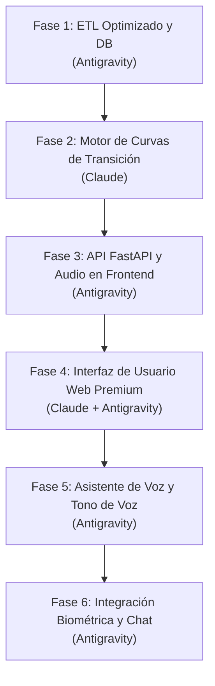

# Plan de Arquitectura y Desarrollo: Reproductor FLAC Inteligente con Transición Curvilínea y Activación por Voz

Este documento contiene la reformulación completa del plan de desarrollo para el **Reproductor FLAC Inteligente**. Se centra en la optimización de coste computacional, la seguridad del código para su distribución en GitHub (evitando malware y vulnerabilidades), y detalla el modelo matemático para la extracción de curvas de transición de audio, técnicas de enmascaramiento y el asistente de voz local con verificación de tono.

---

## 1. Observaciones y Corrección de la Fase 1 (ETL de Audio)

El script `analyzer.py` actual realiza el análisis de BPM mediante la compresión del archivo FLAC completo a un archivo MP3 temporal en `/tmp` usando `ffmpeg` por medio de un subproceso (`subprocess`).

### Crítica y Puntos de Falla en la Fase 1 original:
1. **Uso Excesivo de I/O y CPU**: Comprimir un FLAC completo de ~30-50MB a MP3 solo para extraer el BPM es costoso. `ffmpeg` consume ciclos de CPU significativos que no son necesarios.
2. **Dependencia Externa**: Requiere que el sistema del usuario tenga `ffmpeg` instalado globalmente, complicando el despliegue simple (GitHub-ready).
3. **Escritura en Disco `/tmp`**: Genera escrituras innecesarias en el almacenamiento local.
4. **Falta de Vectores de Transición**: Solo extrae el BPM promedio, lo cual es insuficiente para una transición fluida basada en curvas.

### Reformulación de la Fase 1 (Optimización de Costo):
* **Decodificación Directa en Memoria**: Usar `soundfile` para abrir el FLAC de forma nativa. `soundfile` lee archivos FLAC directamente en arrays de NumPy de forma extremadamente rápida.
* **Carga Parcial (Chunking)**: No cargaremos la canción entera en memoria. 
  - Para calcular el BPM, leeremos un segmento central de 30 segundos.
  - Para los vectores de transición, leeremos únicamente los primeros $T$ segundos (Intro) y los últimos $T$ segundos (Outro), donde $T = 15$ segundos.
  - Esto reduce el consumo de memoria de ~50MB a menos de **3MB** por análisis de canción y elimina la necesidad de archivos temporales y de `ffmpeg`.

---

## 2. Modelo de Vectores de Transición y Curvas de Onda

Para lograr una transición limpia de 2 a 10 segundos, no basta con alinear el ritmo (BPM). Debemos analizar las **curvas de onda** que describen cómo va evolucionando la canción al final y al principio.

### 2.1 Extracción de Vectores de Curva (Features)
Para el Outro (últimos 15s de la canción A) y el Intro (primeros 15s de la canción B) extraeremos:
1. **Curva de Energía RMS ($E(t)$)**: Describe el volumen de la onda a lo largo del tiempo.
2. **Vectores de Chroma ($C(t)$)**: Un vector de 12 elementos que describe el contenido armónico/tonal. Nos dice en qué notas y acordes se mueve la música.
3. **Curva de Centroide Espectral ($S(t)$)**: Describe la "brillantez" o timbre (frecuencias altas vs bajas). Indica si hay voces/platillos activos o si es una sección instrumental oscura.
4. **Beat Grid (Pulsos)**: Timestamps de los golpes de batería para alinear la fase del ritmo.

Estos vectores se calcularán con una resolución temporal baja (ej. ventanas de 0.5 segundos) para que ocupen muy poco espacio en la base de datos SQLite y el cálculo de coincidencia sea instantáneo.

```
Canción A (Outro)             Punto de Transición             Canción B (Intro)
[=== Curva RMS decreciente ===]   ====== FADE ======   [=== Curva RMS creciente ===]
[=== Chroma A (Armónico A) ===]   ==== MATCHING ====   [=== Chroma B (Armónico B) ===]
```

### 2.2 Algoritmo de Coincidencia (Matching)
Cuando la lista de reproducción decida pasar de la Canción A a la B:
1. **Beatmatching**: Se calcula la diferencia de BPM. Si es menor al 8%, se ajusta el *playback rate* de la canción B para sincronizar las cuadrículas de beats.
2. **Alineación de Fase**: Se alinean los tiempos de los beats para que los golpes coincidan exactamente.
3. **Compatibilidad de Curvas**: Se calcula la distancia Euclidiana o Similitud Coseno entre el vector armónico y tímbrico ($C_{out}^A$ y $C_{in}^B$).
   - Si la similitud armónica es alta ($> 0.75$) y la transición de energía es complementaria, se ejecuta una **transición limpia** (crossfade curvilíneo logarítmico de volumen donde la suma de potencias es igual a 1).

### 2.3 Lógica de Enmascaramiento (Enmasking)
Si los vectores de transición no son compatibles (ej. choque tonal fuerte, cambio drástico de BPM, o el usuario fuerza un cambio inmediato mediante el chat):
Se prioriza la **transición limpia mediante enmascaramiento activo (DSP)**:
* **Filtro Pasa-Bajos (Low-pass Sweep)**: Se reduce la frecuencia de corte del filtro de la canción A de 20kHz a 150Hz en 2 segundos. Esto "esconde" los agudos y voces de A, dejando el espectro libre para que entre el intro de B limpio.
* **Efecto Cola de Eco (Delay/Reverb Tail)**: Se activa un efecto de delay/reverberación infinito en la canción A en el último beat, se corta el audio seco de inmediato y se inicia la canción B. La canción B entra mientras la "estela" espacial de A se disipa suavemente.
* **Frenado (Vinyl Brake)**: Se reduce la velocidad de reproducción de A a 0 en 1.5 segundos simulando un tocadiscos apagándose, y se dispara B con un impacto de graves limpio.

*Nota de Optimización*: Todo esto se implementa en el Frontend usando la **API de Web Audio** del navegador. Los filtros, retardos y crossfades se ejecutan directamente en la GPU/hilo de audio del navegador sin consumir recursos del backend de Python.

---

## 3. Seguridad y Prevención de Malware (GitHub-Ready)

Para distribuir este pipeline de forma segura en GitHub sin riesgos para los usuarios:
1. **Evitar Ejecución de Subprocesos Dinámicos**: Eliminar llamadas a `subprocess.run` con comandos variables que puedan ser explotados mediante inyección de argumentos.
2. **Cero Uso de `pickle`**: Para guardar o cargar modelos locales o datos procesados, **no usar el formato pickle** (es vulnerable a ejecución de código remoto). Usar formatos seguros como `JSON`, `Safetensors` (para IA), o almacenamiento directo en la base de datos `SQLite3` con consultas parametrizadas.
3. **Sanitización de Rutas**: Para evitar vulnerabilidades de *Directory Traversal* (lectura de archivos del sistema fuera de la biblioteca de música), se usará una validación estricta de rutas:
   ```python
   def obtener_ruta_segura(ruta_usuario, directorio_base):
       ruta_abs = os.path.abspath(os.path.join(directorio_base, ruta_usuario))
       if not ruta_abs.startswith(os.path.abspath(directorio_base)):
           raise PermissionError("Acceso no autorizado fuera de la biblioteca.")
       return ruta_abs
   ```
4. **Dependencias Auditadas**: Utilizar bibliotecas oficiales y estables instaladas de forma aislada a través de `uv`.

---

## 4. Asistente de Voz Local: Wake Word y Verificación de Tono

El usuario podrá interactuar con el reproductor mediante la voz. Para lograr una experiencia tipo "Google Pixel" (activación directa por frase y tono de voz) sin costos de APIs en la nube:

### 4.1 Arquitectura del Sistema de Voz (100% Local y Gratuito)
1. **Listener de Audio (Micrófono)**: Un hilo secundario en el backend que utiliza `sounddevice` para escuchar en tiempo real con muy bajo consumo de CPU.
2. **Detector de Frase de Activación (Wake Word)**: 
   - Usaremos una biblioteca ligera y libre como **OpenWakeWord** o una detección básica basada en correspondencia de espectro.
3. **Verificación de Tono de Voz (Voice Key)**:
   - Para evitar que cualquiera active el reproductor, se registra un perfil acústico del usuario (Rango de Pitch $F_0$, Formantes y coeficientes MFCC).
   - El detector calcula el tono promedio de la frase clave recibida. Si la huella de frecuencia no coincide con la firma del usuario dentro de un umbral de tolerancia, el comando se ignora.
4. **Speech-to-Text (STT) Local**:
   - Once validado el tono y la frase clave, el micrófono graba el comando y lo procesa usando **Whisper-Tiny** (local, corre en <300ms en CPU) o, alternativamente, la API gratuita de **Web Speech** integrada en el navegador a través del Frontend (cero costo de CPU en el backend).

---

## 5. Plan de Desarrollo Reestructurado y Asignación de Roles de IA

A continuación se presenta la hoja de ruta optimizada por fases, detallando qué Inteligencia Artificial es la idónea para cada desarrollo y las razones técnicas de su elección.



---

### Fase 1: ETL Optimizado y Extracción de Características
* **Responsable**: 🧠 **Antigravity (Yo)**
* **Por qué Antigravity**: Esta fase requiere interactuar directamente con tu sistema de archivos local, verificar versiones de dependencias mediante `uv`, crear scripts físicos y correr validaciones/pruebas directamente sobre tus archivos FLAC reales (como la prueba de 12 canciones que acabamos de hacer). Tengo la capacidad de ejecutar comandos del sistema y validar los resultados in-situ.
* **Objetivo**: Modificar `analyzer.py` para eliminar la dependencia de `ffmpeg` y la carpeta temporal. Extraer BPM y vectores de transición (RMS, Chroma) leyendo únicamente los fragmentos necesarios del FLAC en memoria.
* **Resultado**: [COMPLETADO] Script ultra rápido y seguro. Base de datos `music_library.db` actualizada para soportar vectores de inicio/fin de canciones.

### Fase 2: Motor Lógico de Curvas de Transición (DSP)
* **Responsable**: 🎨 **Claude (Diseño Lógico) + Antigravity (Implementación y Test)**
* **Por qué Claude**: Claude sobresale en razonamiento abstracto, modelado matemático profundo y diseño de algoritmos conceptuales. Es la IA perfecta para estructurar la lógica de alineación de ondas, decidir las fórmulas de similitud (Euclidiana vs. Coseno) entre vectores de croma, y diseñar en papel los pasos para el enmascaramiento DSP.
* **Por qué Antigravity**: Una vez que Claude diseñe el algoritmo, yo (Antigravity) me encargaré de insertarlo en los scripts, enlazarlo con la base de datos y correr pruebas unitarias sobre los datos reales.
* **Objetivo**: Implementar el algoritmo matemático de alinear ondas y cálculo de curvas de transición.
* **Características**:
  - Función de similitud entre Outro(A) e Intro(B).
  - Lógica para determinar si se realiza una transición normal (crossfade lineal o logarítmico) o enmascaramiento (Lowpass sweep, Delay tail, o Vinyl Brake).

### Fase 3: API FastAPI y Reproducción con Web Audio API
* **Responsable**: 🧠 **Antigravity**
* **Por qué Antigravity**: Consiste en la construcción y estructuración del servidor web en Python. Requiere configurar rutas seguras de archivos para evitar vulnerabilidades de seguridad (*Directory Traversal*) y verificar el mapeo de streaming por bytes (HTTP Range) con pruebas de red locales.
* **Objetivo**: Crear el servidor FastAPI que expone los endpoints para servir el audio FLAC en streaming y los metadatos de transición.
* **Características**:
  - Servidor de archivos de música seguro.
  - Endpoint de búsqueda por similitud vectorial (usando sentence-transformers para los prompts de estado de ánimo).
  - Configuración del motor de audio de Web Audio API en el navegador.

### Fase 4: Interfaz de Usuario Web (Frontend Premium)
* **Responsable**: 🎨 **Claude (UI/UX) + Antigravity (Integración)**
* **Por qué Claude**: Claude es un diseñador visual excepcional. Puede generar hojas de estilo CSS sumamente complejas, animaciones con transiciones fluidas, layouts interactivos de DJ basados en grid/flexbox y pulir los detalles estéticos premium (degradados neon, efectos glassmorphism) para lograr el efecto "WOW".
* **Por qué Antigravity**: Yo integraré el HTML/CSS/JS diseñado por Claude en el servidor web local, asegurándome de que el ruteo de archivos y las llamadas fetch a la API funcionen correctamente.
* **Objetivo**: Crear una interfaz visual moderna que "sorprenda" al usuario (Rich Aesthetics).

### Fase 5: Activación por Voz con Filtro de Tono y Fallback Offline
* **Responsable**: 🧠 **Antigravity**
* **Por qué Antigravity**: Implementar un detector de voz local exige el uso de la biblioteca `sounddevice` o similares para interactuar directamente con el hardware del micrófono de tu sistema operativo. Requiere lanzar hilos en segundo plano y probar la ganancia y frecuencias de audio de entrada físicamente en tu entorno Linux.
* **Objetivo**: Implementar el sistema de escucha local del micrófono con consumo mínimo de CPU (< 1%) y soporte para uso sin conexión a internet (Offline).
* **Características**:
  - Script de calibración para registrar el tono de voz ($F_0$) del dueño.
  - Listener en segundo plano (Wake Word Detection usando `openwakeword` de bajo consumo) que detecta la frase clave ("Activa reproductor") y valida el tono de voz.
  - Arquitectura Híbrida de Voz:
    - **Online**: Utiliza la API Web Speech nativa del navegador web de fondo (cero costo de CPU en el proceso de Python y transcripción en la nube del navegador).
    - **Offline (Fallback)**: Conmuta de forma automática y transparente a un modelo local ultra-comprimido de **Faster-Whisper (Tiny - `int8`)** para procesar la grabación de 3 segundos en menos de 300 ms en CPU, garantizando que puedas usar la voz sin internet y sin causar caídas de FPS en tus videojuegos.

### Fase 6: Integración Biométrica (Xiaomi) y Pulido Final
* **Responsable**: 🧠 **Antigravity**
* **Por qué Antigravity**: Trabajar con Bluetooth Low Energy (BLE) a través de `bleak` en Linux requiere acceso a los adaptadores Bluetooth del sistema, análisis de puertos de red y depuración de señales inalámbricas. Al tener acceso a la terminal, puedo correr escaneos de dispositivos Bluetooth para encontrar la dirección MAC de tu pulsera Xiaomi.
* **Objetivo**: Conectar el receptor de pulso Bluetooth para alterar dinámicamente las transiciones en base al estado físico del usuario.

---

## 6. Prompts de Desarrollo (Copia y Pega para avanzar)

Usa los siguientes prompts para interactuar con Claude o conmigo (Antigravity) según corresponda en cada una de las fases del proyecto.

### 📋 Para la Fase 2 (Motor de Curvas y DSP en Python) ➔ Claude
> **Prompt para Claude:**
> "Actúa como un ingeniero senior de procesamiento digital de señales (DSP) y audio en Python. En mi reproductor inteligente de música, tengo una base de datos SQLite con los siguientes vectores de características para el Outro (últimos 15s de la canción A) y el Intro (primeros 15s de la canción B):
> - `rms` (curva de energía/volumen, lista de floats)
> - `chroma` (perfil armónico tonal, lista de arrays de 12 elementos)
> - `spectral_centroid` (brillo tímbrico, lista de floats)
> - `beats` (timestamps de los golpes de ritmo)
>
> Diseña e implementa una función en Python `calcular_transicion_optima(intro_A, outro_B, bpm_A, bpm_B)` que:
> 1. Compare la diferencia de BPM. Si es menor al 8%, recomiende alinear los beats (calculando el factor de multiplicación de velocidad de reproducción para B).
> 2. Calcule la similitud coseno entre las secuencias armónicas de Chroma de A y B.
> 3. Devuelva una recomendación estructurada en JSON con: `tipo_transicion` ('crossfade_suave' si la similitud armónica es >0.75 y los BPM son cercanos, o un efecto de enmascaramiento: 'barrido_filtro', 'freno_vinilo', 'eco_delay' si hay choque de acordes o BPM incompatibles) y los parámetros ideales de duración y alineación de beats."

### 📋 Para la Fase 3 (FastAPI y Web Audio API) ➔ Antigravity
> **Prompt para Antigravity:**
> "Necesito que conectes la API de FastAPI con la reproducción de audio en el frontend. Modifica `main.py` para asegurar que el endpoint `/api/songs` entregue de manera limpia las listas de metadatos de vectores RMS, Chroma y Beats de la base de datos SQLite. Verifica que el endpoint de streaming por bytes `/api/stream/{song_id}` sea seguro contra vulnerabilidades de Directory Traversal y maneje correctamente las cabeceras HTTP Range para permitir adelantar y pausar sin pérdidas en FLAC y MP3."

### 📋 Para la Fase 4 (UI Premium y Visualizadores Ghibli-Moderna) ➔ Claude
> **Prompt para Claude:**
> "Actúa como un diseñador de interfaz de usuario (UI/UX) experto y programador creativo de frontend. Lee primero el archivo de configuración de diseño local `perfil_estetica.json` en la raíz del proyecto. Rediseña por completo la hoja de estilos y la estructura de `index.html` para plasmar fielmente la estética 'Ambient Ethereal / Cloud-Fi Focus' (Ghibli-Moderna) detallada en el JSON:
> 1. Implementa el fondo de gradiente líquido fluido ('aurora gradient') animado sutilmente en bucle imitando el atardecer arequipeño transicionando a la noche.
> 2. Diseña contenedores con 'frosted glass' suave con tonalidades crema, gris nube o lavanda.
> 3. Crea controles flotantes orgánicos sin bordes duros con animaciones de balanceo fluido ('floating-leaf-sway').
> 4. Pon el foco visual en la carátula del álbum con sombras difuminadas dinámicas (drop-shadow).
> 5. Configura las tipografías: Serif ('Playfair Display' o 'Merriweather') para títulos de canciones y Mono/Sans ('JetBrains Mono' o 'Inter') para datos técnicos del archivo (FLAC, canales, bits).
> 6. Adapta el visualizador de Canvas para pintar ondas fluidas y suaves en lugar de barras rígidas, usando los colores de espectro indicados en el perfil estético."

### 📋 Para la Fase 5 (Detección de Voz Local y Tono con Fallback Offline) ➔ Antigravity
> **Prompt para Antigravity:**
> "Vamos a desarrollar el asistente de voz local y seguro con soporte offline. Escribe un script en Python que utilice la biblioteca `sounddevice` para escuchar continuamente el micrófono en un hilo secundario sin sobrecargar la CPU (< 1% de uso continuo) mediante `openwakeword` para detectar la frase clave ('Activa reproductor'). Añade un análisis del pitch promedio ($F_0$) para validar al dueño de la voz. Si coincide, reproduce un pitido de confirmación y graba 3 segundos. Envía el comando al frontend para transcribirse mediante la API Web Speech del navegador si hay conexión a internet; si el backend detecta que estás offline, debe transcribir el comando usando `Faster-Whisper` local (modelo Tiny cuantizado en `int8`) de forma asíncrona para no congelar el juego."

### 📋 Para la Fase 6 (Integración Biométrica BLE) ➔ Antigravity
> **Prompt para Antigravity:**
> "Implementa la integración biométrica. Escribe un script en Python utilizando la biblioteca `bleak` que busque y establezca conexión local Bluetooth LE con mi pulsera Xiaomi Mi Band. El script debe ejecutarse en segundo plano, leer periódicamente el valor del servicio del sensor de frecuencia cardíaca (Heart Rate) y enviar el pulso promedio a un endpoint del reproductor de música. Si los latidos cardíacos superan los 120 BPM, el backend debe forzar de inmediato una transición mediante 'freno de vinilo' hacia la siguiente pista de alta energía en la lista."

---

## 7. Estrategia de Control de Versiones y Respaldos (Git) 🐙

Para asegurar la integridad del proyecto y poder restaurar cambios en caso de fallos, seguiremos estas directrices de Git:
1.  **Ignorar Archivos Gigantes e Locales**: Mantener un archivo `.gitignore` estricto que evite registrar archivos `.venv`, la base de datos `music_library.db` y los modelos descargados en `models/`.
2.  **Uso de Ramas por Fase**:
    *   No programar directamente en `main` durante el desarrollo de cada fase.
    *   Crear una rama con `git checkout -b fase-X-nombre` antes de iniciar.
    *   Una vez probada y verificada la fase, regresar a `main` y realizar un `git merge`.
3.  **Commits Atómicos**: Escribir commits incrementales del tipo `feat(...)` o `fix(...)` para rastrear los cambios lógicos del desarrollo.


